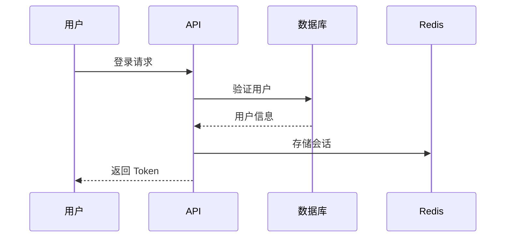

# 研发需求文档模板

本文档定义了研发需求文档的标准结构和内容要求。

## 文档结构

### 1. 项目概述

```markdown
## 1. 项目概述

### 1.1 项目背景
- 项目起源和业务背景
- 解决的核心问题
- 预期收益

### 1.2 项目目标
- 核心目标（SMART 原则）
- 成功指标/KPI

### 1.3 技术栈选型
| 类别 | 技术选型 | 版本 | 说明 |
|-----|---------|-----|-----|
| 开发语言 | Python | 3.10+ | 后端服务 |
| Web 框架 | FastAPI | 0.100+ | REST API |
| 数据库 | PostgreSQL | 15+ | 主数据存储 |
| 缓存 | Redis | 7+ | 会话/缓存 |
| 消息队列 | RabbitMQ | 3.12+ | 异步任务 |
```

### 2. 系统架构

```markdown
## 2. 系统架构

### 2.1 整体架构图
[使用 Mermaid 或图片展示系统架构]

### 2.2 模块划分
| 模块名称 | 职责描述 | 技术实现 |
|---------|---------|---------|
| 用户模块 | 用户注册、登录、权限 | FastAPI + JWT |
| 订单模块 | 订单创建、支付、履约 | FastAPI + 状态机 |

### 2.3 技术组件
- 网关层：Nginx / Kong
- 服务层：FastAPI 微服务
- 数据层：PostgreSQL + Redis
- 基础设施：Docker + K8s
```

### 3. 数据模型设计

```markdown
## 3. 数据模型设计

### 3.1 ER 图
[使用 Mermaid erDiagram 展示实体关系]

### 3.2 表结构定义

#### users 用户表
| 字段名 | 类型 | 约束 | 说明 |
|-------|-----|-----|-----|
| id | BIGINT | PK, AUTO_INCREMENT | 主键 |
| username | VARCHAR(50) | UNIQUE, NOT NULL | 用户名 |
| email | VARCHAR(100) | UNIQUE, NOT NULL | 邮箱 |
| password_hash | VARCHAR(255) | NOT NULL | 密码哈希 |
| created_at | TIMESTAMP | DEFAULT NOW() | 创建时间 |
| updated_at | TIMESTAMP | ON UPDATE NOW() | 更新时间 |

索引设计：
- idx_users_email (email) - 登录查询
- idx_users_username (username) - 用户名查询

### 3.3 Redis 数据结构

| Key 模式 | 类型 | TTL | 说明 |
|---------|-----|-----|-----|
| user:session:{token} | STRING | 24h | 用户会话 |
| user:profile:{id} | HASH | 1h | 用户信息缓存 |
```

### 4. API 接口设计

```markdown
## 4. API 接口设计

### 4.1 接口规范
- 基础路径：`/api/v1`
- 认证方式：Bearer Token (JWT)
- 响应格式：JSON

### 4.2 通用响应结构
```json
{
  "code": 0,
  "message": "success",
  "data": { ... },
  "timestamp": 1234567890
}
```

### 4.3 接口列表

#### 4.3.1 用户模块

**POST /api/v1/users/register - 用户注册**

请求参数：
```json
{
  "username": "string, 用户名, 必填, 3-20字符",
  "email": "string, 邮箱, 必填",
  "password": "string, 密码, 必填, 8-32字符"
}
```

响应示例：
```json
{
  "code": 0,
  "message": "注册成功",
  "data": {
    "user_id": 123,
    "username": "example"
  }
}
```

错误码：
| 错误码 | 说明 |
|-------|-----|
| 10001 | 用户名已存在 |
| 10002 | 邮箱已注册 |
| 10003 | 密码强度不够 |
```

### 5. 功能模块详设

```markdown
## 5. 功能模块详设

### 5.1 用户认证模块

#### 5.1.1 功能描述
- 用户注册（邮箱验证）
- 用户登录（密码/验证码）
- 会话管理（Token 刷新）
- 密码找回

#### 5.1.2 业务流程



#### 5.1.3 实现方案
- 密码存储：bcrypt 哈希
- Token 生成：JWT (HS256)
- Token 有效期：Access Token 2h, Refresh Token 7d

#### 5.1.4 关键代码示例

```python
from passlib.context import CryptContext
from jose import jwt

pwd_context = CryptContext(schemes=["bcrypt"])

def hash_password(password: str) -> str:
    return pwd_context.hash(password)

def verify_password(plain: str, hashed: str) -> bool:
    return pwd_context.verify(plain, hashed)

def create_access_token(user_id: int) -> str:
    payload = {
        "sub": str(user_id),
        "exp": datetime.utcnow() + timedelta(hours=2)
    }
    return jwt.encode(payload, SECRET_KEY, algorithm="HS256")
```
```

### 6. 非功能需求

```markdown
## 6. 非功能需求

### 6.1 性能要求
| 指标 | 要求 |
|-----|-----|
| API 响应时间 | P99 < 200ms |
| 并发用户数 | 1000 QPS |
| 数据库查询 | 单表查询 < 10ms |

### 6.2 安全要求
- [ ] SQL 注入防护（ORM 参数化查询）
- [ ] XSS 防护（输出编码）
- [ ] CSRF 防护（Token 验证）
- [ ] 敏感数据加密（AES-256）
- [ ] HTTPS 强制

### 6.3 可用性要求
- SLA: 99.9%
- RTO: < 1 小时
- RPO: < 5 分钟
```

### 7. 开发计划

```markdown
## 7. 开发计划

### 7.1 里程碑
| 阶段 | 内容 | 交付物 |
|-----|-----|-------|
| M1 | 基础架构搭建 | 项目骨架、CI/CD |
| M2 | 核心功能开发 | 用户模块、订单模块 |
| M3 | 联调测试 | 接口文档、测试报告 |
| M4 | 上线发布 | 部署文档、运维手册 |

### 7.2 任务分解
- [ ] 数据库设计与建表
- [ ] API 接口开发
- [ ] 单元测试编写
- [ ] 接口文档编写
- [ ] 性能测试

### 7.3 风险评估
| 风险 | 等级 | 应对措施 |
|-----|-----|---------|
| 第三方 API 不稳定 | 中 | 熔断机制、重试策略 |
| 数据量增长超预期 | 低 | 分库分表预案 |
```

## 最佳实践

### 技术栈对应模板

#### Python + FastAPI
- ORM: SQLAlchemy 2.0 + asyncpg
- 验证: Pydantic v2
- 测试: pytest + httpx
- 文档: OpenAPI (自动生成)

#### Java + Spring Boot
- ORM: MyBatis-Plus / JPA
- 验证: Jakarta Validation
- 测试: JUnit 5 + MockMvc
- 文档: SpringDoc OpenAPI

#### Go + Gin
- ORM: GORM
- 验证: go-playground/validator
- 测试: testing + httptest
- 文档: swaggo/swag

#### Node.js + NestJS
- ORM: Prisma / TypeORM
- 验证: class-validator
- 测试: Jest + supertest
- 文档: @nestjs/swagger
