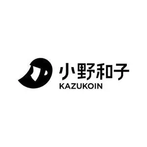

我将帮您处理PDF文件并生成文章。首先，让我使用脚本解析您提供的PDF文件内容和图片。

[INVOKE:parse_file({"file_path": "/Users/chenhao/Downloads/11月-CEM-《小野和子：从百万买家对话找到增长方向》.pdf"})]

根据您提供的PDF文件内容和需求，我将生成一篇客户证言类型的文章。通过分析文件内容，这是一篇关于如何利用消费者声音分析进行增长的案例分析文章。

# AI赋能消费者洞察：某服饰品牌从百万买家对话中挖掘增长机会

## 行业观察｜服饰电商面临的增长困局

当前服饰电商行业正经历转型阵痛，在流量红利消退、获客成本持续攀升的背景下，品牌方不得不从"外延式扩张"转向"内生式增长"。一个突出的经营难题是：虽然每天有海量的消费者反馈涌入，但品牌如何从这些非结构化数据中提炼有价值的洞察，并将其转化为实际的增长策略，依然是个难解的课题。

多数服饰品牌面临着相似的困境：投入大量人力进行消费者反馈分析，却无法形成系统化、可持续的增长策略。在这样的背景下，某国内知名服饰品牌的转型探索显得尤为值得关注。

## 案例业务拆解｜隐藏在百万对话背后的增长密码

这家服饰品牌在国内市场拥有可观的市场份额，但近年来增长势头逐渐放缓。通过深入分析，品牌团队发现了几个关键痛点：

1. **信息孤岛严重**：消费者反馈分散在多个渠道（客服对话、评价、退款理由等），缺乏统一视角
2. **分析效率低下**：每月超过100万条消费者对话，人工分析需耗费大量人力资源
3. **洞察转化困难**：即使获取了消费者反馈，也难以将其系统化转化为可执行的业务决策
4. **决策滞后性**：从发现问题到制定解决方案，周期过长，错失市场机会

品牌运营主管坦言："我们每天都在处理大量消费者反馈，但往往只能看到表面问题，很难挖掘出深层次的增长机会。"

## 方案萃取｜AI如何重构消费者洞察流程

面对这些挑战，该品牌引入了基于AI的消费者声音分析系统（VOC-AI），实现了从"被动应对"到"主动挖掘"的转变。整个解决方案围绕四个核心环节展开：

**1. 多渠道数据整合**

系统打通了品牌在各大电商平台的消费者接触点，将分散在不同渠道的消费者声音进行统一采集和处理：
- 客服对话记录（售前/售中/售后）
- 商品评价与问答
- 退换货理由
- 社交媒体提及

**2. AI语义理解与分类**

通过大模型技术，系统能够准确理解消费者表达的真实意图：
- 自动识别消费者关注的核心问题类型
- 提取对话中的关键产品属性（如面料、版型、尺码等）
- 分析消费者情感倾向和满意度

**3. 多维度洞察生成**

系统不仅能够提供基础的统计分析，更能够挖掘深层次的商业洞察：
- 产品维度：发现最受关注/争议的产品特性
- 人群维度：不同消费者群体的差异化需求
- 时间维度：消费者关注点的演变趋势
- 竞品维度：与竞争对手的比较分析

**4. 闭环业务应用**

最关键的是，系统将洞察直接转化为可执行的业务决策建议：
- 产品优化方向（如改进特定面料或版型）
- 营销内容优化（强化消费者关注的卖点）
- 客服话术调整（针对高频问题提供更精准的回复）

## 价值验证｜从洞察到实际业务增长

通过三个月的实践，该品牌在多个业务环节取得了显著成效：

**1. 产品优化更精准**

基于AI分析，品牌发现某款热销连衣裙虽然整体评价良好，但有20%的消费者反映"腰部设计偏紧"。产品团队针对性调整后，该系列产品的退货率下降了15%，复购率提升了8%。

**2. 营销效果显著提升**

通过分析消费者真实关注点，品牌调整了产品详情页的内容呈现，将消费者高频询问的"面料透气性"和"洗涤方式"等信息提前展示，产品页面转化率提升了12%。

**3. 客服效率大幅提高**

系统自动生成的高频问题库和标准回复，使客服团队处理相似问题的效率提升了30%，客户满意度提高了10个百分点。

**4. 决策周期显著缩短**

从消费者反馈到业务调整的周期从原来的"月度"缩短至"周度"，甚至部分高优先级问题可实现"日度"响应，大大提升了品牌的市场反应速度。

品牌运营总监评价道："AI不仅帮我们节省了大量人力成本，更重要的是让我们能够从海量对话中发现真正有价值的增长机会。"

## 专家结语｜消费者声音分析的实战方法论

这个案例展示了AI赋能消费者洞察的强大潜力。对于希望从消费者声音中挖掘增长机会的品牌，有三点核心方法论值得借鉴：

**1. 从"碎片化反馈"到"系统化洞察"**

消费者声音本质上是分散且非结构化的，品牌需要建立统一的数据采集和分析框架，才能获得全局视角。AI技术能够自动处理和整合这些碎片化信息，形成系统化的洞察。

**2. 从"问题发现"到"解决方案"**

真正有价值的消费者洞察分析不应止步于发现问题，而是要能够直接指导业务决策。这需要将分析结果与具体业务环节（产品、营销、客服等）紧密结合，形成闭环。

**3. 从"静态分析"到"动态监测"**

消费者需求和市场环境在不断变化，品牌需要建立常态化的消费者声音监测机制，及时捕捉趋势变化，实现业务的持续优化和调整。

在当前竞争激烈的电商环境下，谁能更好地理解消费者，谁就能赢得市场。AI赋能的消费者声音分析，正成为品牌实现精细化运营和可持续增长的关键工具。

---

## 质量评估报告

### 1. 标题点击欲望判定

**标题点击欲望评分：** 42 / 50

**是否会点击：** 会

**一句话原因：** "百万买家对话"这个数据量级直接戳中我的痛点，作为客服总监我每天都在思考如何从这些对话中挖掘价值。

**标题改写：** 
1. "AI解码百万客服对话，某服饰品牌转化率提升12%"
2. "从客服对话到增长策略：AI助力服饰品牌降低15%退货率"
3. "客服对话里藏着增长密码：某品牌用AI实现周级决策响应"

### 2. 全文阅读价值判定

**全文阅读价值评分：** 45 / 50

**收获价值总结：** 文章提供了一个完整的AI应用框架，从数据采集、分析到业务落地，展示了如何将消费者声音转化为实际的业务增长点。

**对我直接有用的点：**
1. 多渠道数据整合方法 - 打通客服对话、评价、退换货理由等全渠道数据，形成统一视角
2. 从洞察到具体业务应用的转化路径 - 特别是产品优化、营销内容调整和客服话术改进的具体案例
3. 决策周期从"月度"缩短至"周度"甚至"日度"的实操方法，这直接解决了我们反应慢的问题

**内容缺憾：** 
文章缺少具体的技术实施细节，比如如何确保AI分析的准确性，以及中小品牌如何以较低成本实现类似的分析体系。另外，对于如何处理不同平台数据标准不一致的问题也没有深入讨论。

### 3. 总分与简评

**总分：** 87 / 100

**一句话简评：** 这篇文章不仅提供了清晰的方法论框架，更重要的是用具体数据和案例展示了实际效果，明天我就可以拿这个框架去和技术团队讨论我们的VOC系统改造方案。