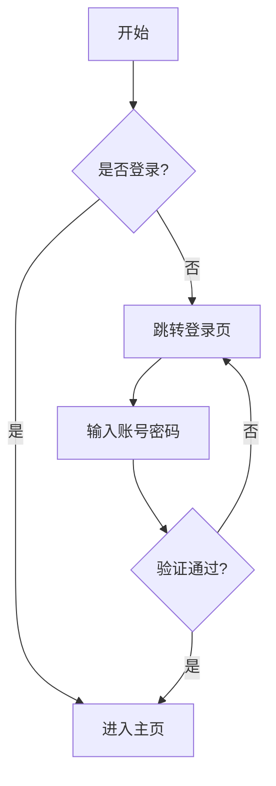

# Multi-Chart-Draw

一个功能强大的 Claude Code Skill，支持多种图表类型的智能绘制。

## 安装 Skill

### 方法一：添加到项目（推荐）

将此 Skill 文件夹复制到你项目的 `.claude/skills/` 目录下：

```bash
# 在你的项目根目录执行
mkdir -p .claude/skills
cp -r /path/to/multi-chart-draw .claude/skills/
```

目录结构：
```
your-project/
├── .claude/
│   └── skills/
│       └── multi-chart-draw/
│           ├── SKILL.md
│           ├── scripts/
│           ├── references/
│           └── ...
└── ...
```

### 方法二：添加到全局 Skills

将 Skill 添加到用户级别的 Claude Code 配置中：

```bash
# macOS/Linux
cp -r /path/to/multi-chart-draw ~/.claude/skills/

# Windows
xcopy /E /I "path\to\multi-chart-draw" "%USERPROFILE%\.claude\skills\multi-chart-draw"
```

### 方法三：通过 Git 子模块

```bash
# 在你的项目根目录
mkdir -p .claude/skills
cd .claude/skills
git submodule add <repository-url> multi-chart-draw
```

## 功能特性

| 图表类型 | 用途 | 输出格式 |
|---------|------|---------|
| **Mermaid** | 流程图、序列图、甘特图、类图、ER图 | PNG, SVG |
| **ECharts** | 柱状图、折线图、饼图、散点图等数据可视化 | HTML (交互式) |
| **Mindmap** | 思维导图、知识结构、项目规划 | SVG, PNG |
| **DrawIO** | 系统架构图、网络拓扑、部署图、UML | HTML (交互式) |
| **GeoGebra** | 数学函数、几何图形、代数方程、统计分析 | HTML (交互式) |

## 快速开始

### 1. 安装 Skill

按照上述"安装 Skill"章节的方法，将 Skill 添加到你的项目或全局配置中。

### 2. 安装系统依赖

```bash
# Python 依赖
pip install pyecharts>=2.0.0 pillow>=10.0.0

# Node.js 依赖（Mermaid 和 Mindmap 渲染需要）
npm install -g @mermaid-js/mermaid-cli
npm install -g markmap-cli

# 验证安装
mmdc --version
markmap --version
```

> **注意**：如果只使用 ECharts、DrawIO 或 GeoGebra，可以跳过 Node.js 依赖安装。

### 3. 创建输出目录

```bash
mkdir -p ./charts-output
```

### 4. 验证安装

在 Claude Code 中输入 `/multi-chart-draw` 或描述绘图需求，如果 Skill 正确安装，Claude 会自动识别并使用该 Skill。

### 5. 使用 Skill

在 Claude Code 中直接描述你的绘图需求：

```
画一个用户注册流程图
生成一个季度销售额柱状图
创建一个项目规划的思维导图
绘制微服务系统架构图
画一个 y = x² 的函数图像
```

## 项目结构

```
multi-chart-draw/
├── SKILL.md                 # Skill 定义文件
├── README.md                # 项目说明
├── scripts/                 # 渲染脚本
│   ├── render_mermaid.py    # Mermaid 渲染
│   ├── render_echarts.py    # ECharts 渲染
│   ├── render_mindmap.py    # 思维导图渲染
│   ├── render_drawio.py     # DrawIO 渲染
│   └── render_geogebra.py   # GeoGebra 渲染
├── references/              # 语法参考文档
│   ├── mermaid-syntax.md    # Mermaid 语法
│   ├── echarts-guide.md     # ECharts 配置指南
│   ├── mindmap-guide.md     # 思维导图格式
│   ├── drawio-guide.md      # DrawIO XML 格式
│   └── geogebra-guide.md    # GeoGebra 命令语法
├── assets/
│   └── examples/            # 示例文件
└── charts-output/           # 输出目录
```

## 渲染脚本使用

### Mermaid 图表

```bash
python scripts/render_mermaid.py \
  --input flowchart.mmd \
  --output ./charts-output/flowchart.png \
  --format png  # 或 svg
```

### ECharts 图表

```bash
python scripts/render_echarts.py \
  --config chart-config.json \
  --output ./charts-output/chart.html
```

### 思维导图

```bash
python scripts/render_mindmap.py \
  --input mindmap.md \
  --output ./charts-output/mindmap.svg \
  --format svg  # 或 png
```

### DrawIO 图表

```bash
python scripts/render_drawio.py \
  --input architecture.xml \
  --output ./charts-output/architecture.html
```

### GeoGebra 图表

```bash
python scripts/render_geogebra.py \
  --input commands.txt \
  --output ./charts-output/math.html
```

## 图表类型选择指南

| 需求场景 | 推荐类型 |
|---------|---------|
| 层级结构、知识梳理、项目规划 | Mindmap |
| 简单流程图、决策流程、算法流程 | Mermaid Flowchart |
| API调用、消息传递、交互流程 | Mermaid Sequence |
| 项目进度、时间规划 | Mermaid Gantt |
| 数据对比、趋势分析、统计图表 | ECharts |
| 系统架构、网络拓扑、部署图 | DrawIO |
| 复杂 ER 图、UML 图 | DrawIO |
| 数学函数、几何图形 | GeoGebra |
| 代数方程、统计分析 | GeoGebra |

## 示例

### Mermaid 流程图



### ECharts 配置

```json
{
  "title": {"text": "月度销售额"},
  "xAxis": {"type": "category", "data": ["1月", "2月", "3月"]},
  "yAxis": {"type": "value"},
  "series": [
    {"name": "产品A", "type": "bar", "data": [120, 200, 150]},
    {"name": "产品B", "type": "bar", "data": [80, 150, 180]}
  ]
}
```

### Mindmap 格式

```markdown
# 项目规划

## 第一阶段
### 需求分析
### 技术选型

## 第二阶段
### 开发实现
### 测试验证

## 第三阶段
### 部署上线
### 运维监控
```

### GeoGebra 命令

```
# 函数图像
f(x) = x^2
g(x) = sin(x)

# 几何图形
A = (0, 0)
B = (4, 0)
C = (2, 3)
Polygon(A, B, C)
```

## 注意事项

### ECharts 多系列图表

将所有系列放在一个配置文件的 `series` 数组中：

```json
{
  "series": [
    {"name": "系列1", "type": "bar", "data": [...]},
    {"name": "系列2", "type": "bar", "data": [...]},
    {"name": "系列3", "type": "bar", "data": [...]}
  ]
}
```

**不要**为每个系列创建单独的配置文件。

### GeoGebra 命令

- 命令必须使用英文（如 `Polygon`，不是 `多边形`）
- 支持 `#` 开头的注释行
- 脚本会自动检测命令类型，选择合适的应用模式（graphing/geometry/3d）

### 输出文件管理

- 建议统一使用 `./charts-output/` 目录
- 使用有意义的文件名，如 `flowchart-user-registration.png`
- SVG 适合矢量编辑，PNG 适合展示，HTML 支持交互

## 技术实现

- **Mermaid**: 使用 `@mermaid-js/mermaid-cli` (mmdc) 渲染
- **ECharts**: 生成嵌入 ECharts 的 HTML 页面
- **Mindmap**: 使用 `markmap-cli` 渲染
- **DrawIO**: 使用 draw.io 嵌入式编辑器 API
- **GeoGebra**: 使用 GeoGebra Materials API，支持自动检测应用类型

## License

MIT
