# Mermaid 语法参考

## 目录
1. [基础语法](#基础语法)
2. [流程图](#流程图)
3. [序列图](#序列图)
4. [类图](#类图)
5. [状态图](#状态图)
6. [甘特图](#甘特图)
7. [ER图](#er图)
8. [常见示例](#常见示例)

## 概览
Mermaid 是一种基于文本的图表描述语言，支持多种图表类型，适合快速绘制流程图、序列图等。

## 基础语法

### 代码块格式
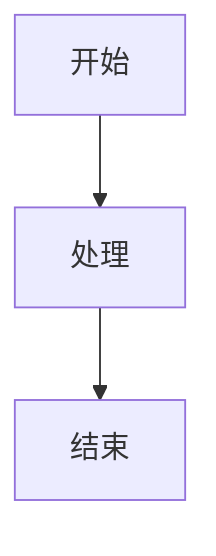

### 方向声明
- `TB` / `TD` - Top to Bottom（从上到下）
- `BT` - Bottom to Top（从下到上）
- `RL` - Right to Left（从右到左）
- `LR` - Left to Right（从左到右）

## 流程图

### 基本节点
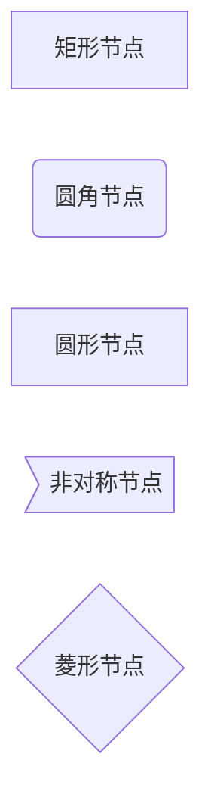

### 连接关系
```mermaid
graph LR
    A --> B          # 箭头
    A --- B          # 无箭头线
    A -->|标签| B    # 带标签的箭头
    A ==>|标签| B    # 粗箭头
    A -.->|标签| B   # 虚线箭头
```

### 子图
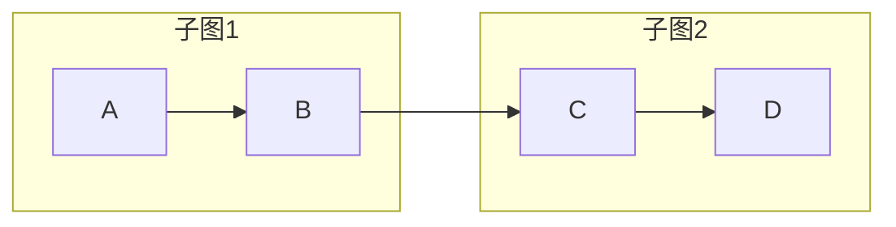

## 序列图

### 基本语法
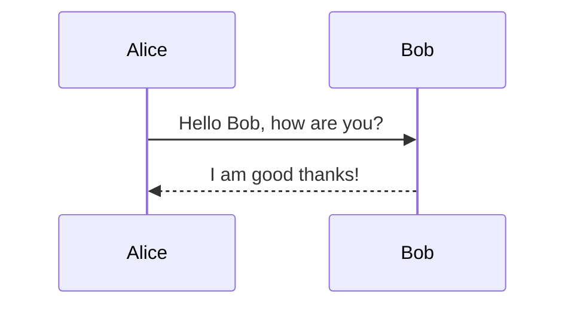

### 激活框
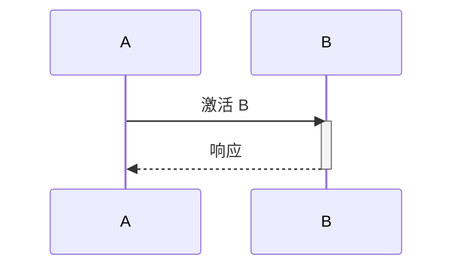

### 循环和条件
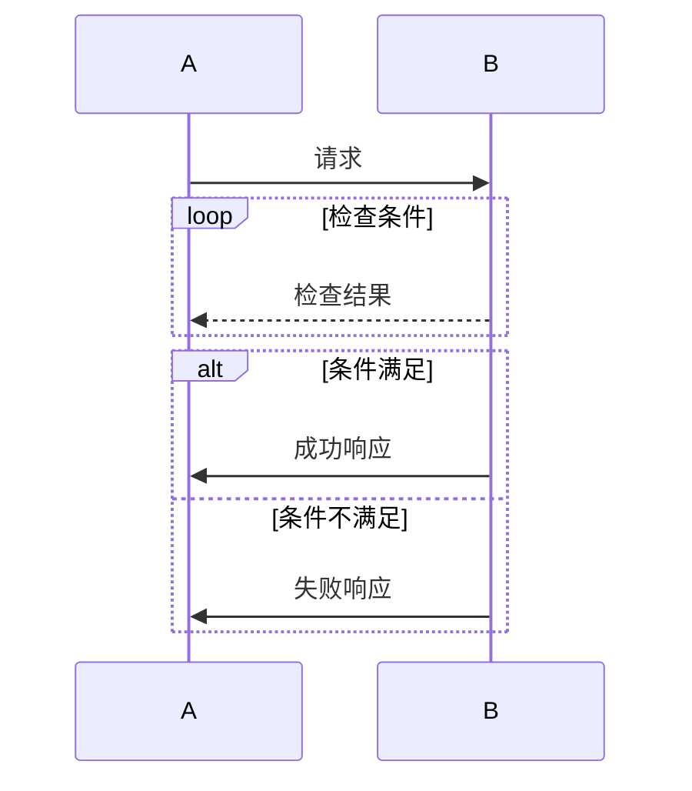

## 类图

### 基本语法
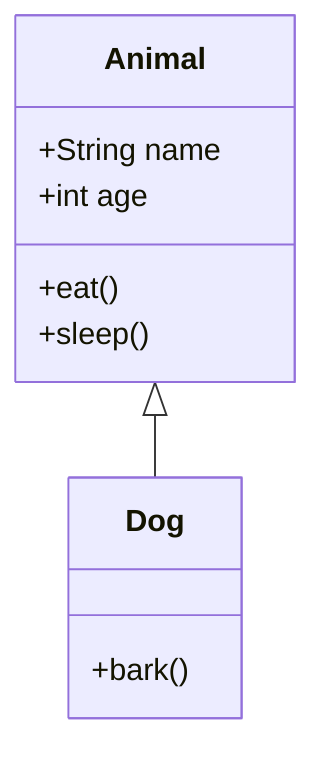

### 关系类型
- `<|--` - 继承
- `*--` - 组合
- `o--` - 聚合
- `-->` - 关联
- `..>` - 依赖

## 状态图

### 基本语法
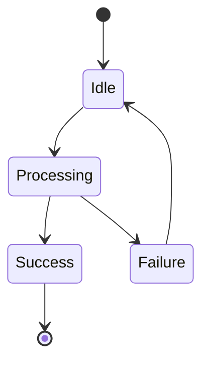

## 甘特图

### 基本语法
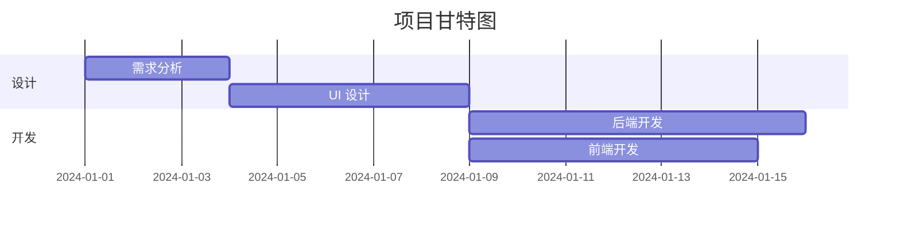

## ER图

### 基本语法
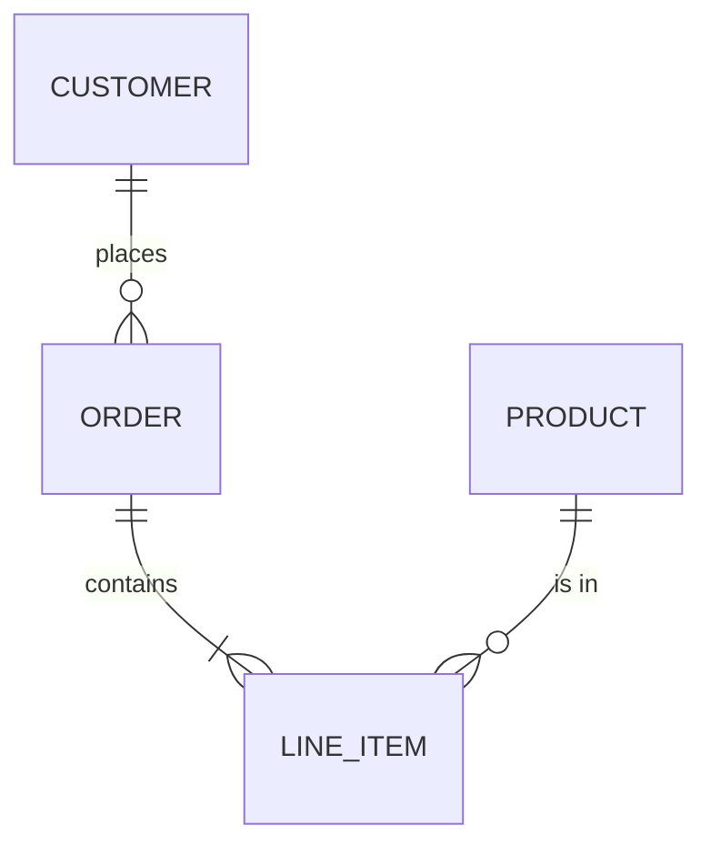

### 关系类型
- `||--||` - 一对一
- `||--|{` - 一对多
- `||--o{` - 一对多（可选）
- `}|--||` - 多对一
- `}o--||` - 多对一（可选）

## 常见示例

### 示例 1：用户注册流程
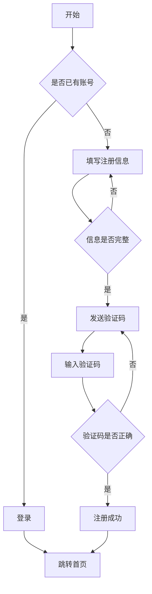

### 示例 2：API 调用序列
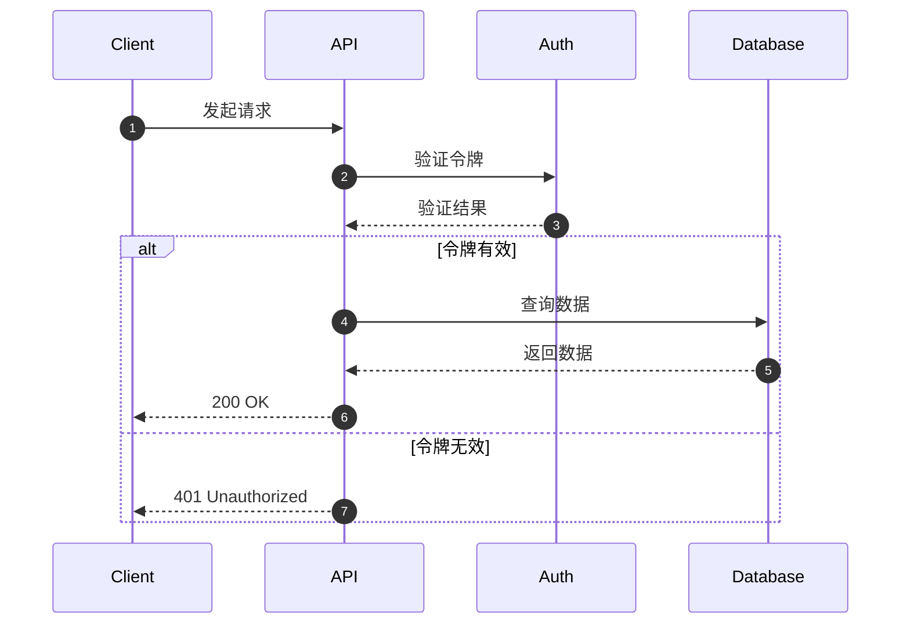

### 示例 3：系统架构
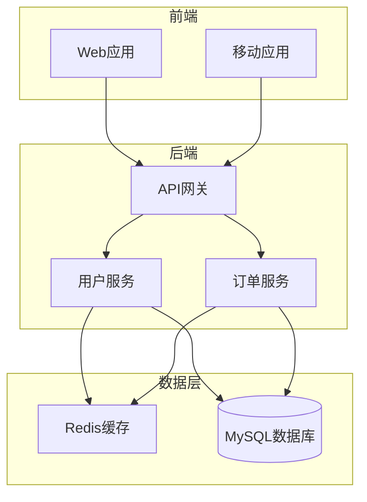

### 示例 4：项目进度甘特图
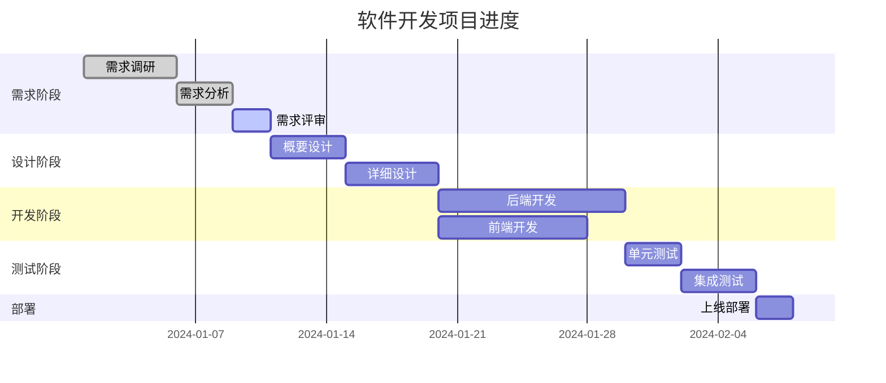

## 注意事项
- 节点名称必须唯一
- 箭头方向要符合逻辑
- 复杂图表建议使用子图组织
- 中文支持：Mermaid 原生支持中文
- 输出格式：推荐 SVG（矢量图）或 PNG（位图）
